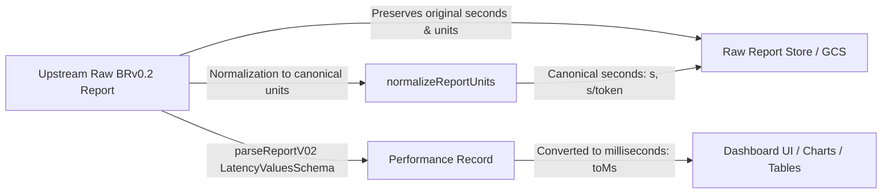

# Prism Results API Unit Handling, Defaulting & Normalization Specification

This document serves as the canonical reference for how Prism parses,
canonicalizes, validates, and defaults metric units across benchmark reports.

---

## 1. Core Architecture & Unit Representations

Prism operates with a **dual unit representation** model across its pipeline:



1. **Storage / Ingestion Tier (Canonical Units)**:
    - Request-level latencies (`request_latency`, `time_to_first_token`, pod
      startup times) are stored in **seconds (`s`)**.
    - Per-token latencies (`time_per_output_token`, `inter_token_latency`,
      `normalized_time_per_output_token`) are stored in **seconds per token
      (`s/token`)**.
    - Throughput metrics are stored in rates (**`tokens/s`** for token rates,
      **`queries/s`** for request rates).
    - The original raw report (`rawReport` / `raw_report`) is preserved intact
      to prevent loss of precision or unmapped attributes.

2. **Presentation / UI Tier (Display Units)**:
    - For human readability and chart scaling, latencies are converted from
      seconds to **milliseconds (`ms`)** or **milliseconds per token
      (`ms/token`)**.
    - Tooltips, scatter plots, and summary cards display millisecond values
      while preserving underlying canonical units in payload exports.

---

## 2. Unit Parsing & Scaling Factors (`unitToSecondsFactor`)

When parsing metric blocks, Prism resolves unit strings using case-insensitive
and whitespace-tolerant normalization (`unit.trim().toLowerCase()` with
normalized `/` separators).

| Declared Unit String(s)                                               | Multiplier to Canonical Seconds | Notes                                  |
| :-------------------------------------------------------------------- | :------------------------------ | :------------------------------------- |
| `s`, `sec`, `second`, `seconds`, `s/token`, `s / token`               | `1.0`                           | Canonical seconds base unit            |
| `ms`, `msec`, `millisecond`, `milliseconds`, `ms/token`, `ms / token` | `1e-3`                          | Multiplied by 0.001                    |
| `us`, `µs`, `microsecond`, `microseconds`, `us/token`, `µs/token`     | `1e-6`                          | Multiplied by 1e-6                     |
| `ns`, `nsec`, `nanosecond`, `nanoseconds`, `ns/token`, `nsec/token`   | `1e-9`                          | Multiplied by 1e-9                     |
| Empty, `null`, `undefined`, or unrecognized custom string             | `1.0`                           | Numbers kept unscaled; assumed seconds |

---

## 3. Per-Token vs. Request-Level Latency Distinction

A common source of confusion in benchmark ingestion is the distinction between
per-token metrics and request-level metrics.

### 3.1 Per-Token Metrics (`isPerTokenMetric`)

Metrics that evaluate throughput-normalized or incremental token delays belong
to the per-token category:

- `time_per_output_token` (TPOT)
- `normalized_time_per_output_token` (NTPOT)
- `inter_token_latency` (ITL)
- Any metric key containing `per_output_token`, `per_token`, or `/token`

**Canonical Unit:** `s/token` (displayed as `ms` / `ms/token`).

### 3.2 Request-Level Metrics

Metrics measuring overall request duration or execution phases:

- `request_latency` (End-to-End latency)
- `time_to_first_token` (TTFT)
- `pod_startup_times` (`aggregate` and `by_pod.*`)
- Session performance latencies

**Canonical Unit:** `s` (displayed as `ms` or `s`).

> [!IMPORTANT]
>
> **The TTFT Quirk (`time_to_first_token` is NOT per-token)**: Although
> `time_to_first_token` contains the substring `token`, it represents the
> elapsed duration from request dispatch until the arrival of the first token.
> Its unit is **seconds (`s`)**, never `s/token`. The `isPerTokenMetric` helper
> explicitly excludes `time_to_first_token`.

---

## 4. Missing Unit Detection & Default Assumptions

Upstream benchmark harnesses (e.g., custom test scripts or legacy harnesses)
sometimes emit metric data blocks containing numbers without an explicit `units`
property.

Prism detects these omissions using
`detectMissingUnitWarnings(rawReport, filename)`.

### 4.1 Default Assumptions by Field

| Metric JSON Path Pattern                                               | Assumed Default Unit | Label / Display                 |
| :--------------------------------------------------------------------- | :------------------- | :------------------------------ |
| `$.results.request_performance.aggregate.latency.*` (request-level)    | `s`                  | `'s' (seconds)`                 |
| `$.results.request_performance.aggregate.latency.*` (per-token)        | `s/token`            | `'s/token' (seconds per token)` |
| `$.results.request_performance.aggregate.throughput.output_token_rate` | `tokens/s`           | `'tokens/s'`                    |
| `$.results.request_performance.aggregate.throughput.total_token_rate`  | `tokens/s`           | `'tokens/s'`                    |
| `$.results.request_performance.aggregate.throughput.input_token_rate`  | `tokens/s`           | `'tokens/s'`                    |
| `$.results.request_performance.aggregate.throughput.request_rate`      | `queries/s`          | `'queries/s'`                   |
| `$.results.request_performance.time_series.latency.*` (request-level)  | `s`                  | `'s' (seconds)`                 |
| `$.results.request_performance.time_series.latency.*` (per-token)      | `s/token`            | `'s/token' (seconds per token)` |
| `$.results.observability.pod_startup_times.aggregate`                  | `s`                  | `'s' (seconds)`                 |
| `$.results.observability.pod_startup_times.by_pod.*`                   | `s`                  | `'s' (seconds)`                 |
| `$.results.session_performance.aggregate.latency.*` (request-level)    | `s`                  | `'s' (seconds)`                 |
| `$.results.session_performance.aggregate.latency.*` (per-token)        | `s/token`            | `'s/token' (seconds per token)` |

### 4.2 Structured Warning Format

Whenever units are missing from a metric that contains actual numeric data,
Prism records a non-blocking diagnostic warning:

```text
[<filename>] Missing units for '<jsonPath>'; assumed <defaultUnit>, but validation is needed since units are missing from original report file.
```

**Example:**

```text
[stage_0.json] Missing units for '$.results.request_performance.aggregate.latency.request_latency'; assumed 's' (seconds), but validation is needed since units are missing from original report file.
```

### 4.3 Pipeline Propagation

1. `parseReportV02(rawDoc, filename)`: Evaluates
   `detectMissingUnitWarnings(rawDoc)` directly on the untouched raw report and
   records warnings in `stage.warnings`.
2. `stageToEntry(stage)`: Transfers `stage.warnings` into entry diagnostics
   (`entry._diagnostics.msg`).
3. `validateBenchmark`: Surfaces missing unit warnings in `result.warnings`.
4. `validatePrismUploadStructure`: Records warnings in
   `uploadValidation.warnings` and attaches them to `fieldErrors` with severity
   `'warning'`.
5. **Non-Blocking Rule:** Warnings do not invalidate uploads (`isValid` remains
   `true` as long as `errors.length === 0`).

---

## 5. Zod Schema Preservation & Quirks

Prism uses runtime Zod schemas to validate ingestion structures.

> [!WARNING]
>
> **Zod Stripping Pitfall**: By default, Zod objects strip unlisted properties
> unless `.passthrough()` is declared. If a nested metric schema omits `units`
> or lacks `.passthrough()`, `zod.safeParse()` silently discards the `units` key
> during parsing.

To guarantee that units and upstream attributes are never lost:

1. **`ThroughputMetricSchema`**:
    ```javascript
    const ThroughputMetricSchema = z
        .object({
            units: z.string().optional().nullable(),
            mean: numericField.optional(),
            p50: numericField.optional(),
            p99: numericField.optional(),
        })
        .passthrough()
        .optional()
        .nullable();
    ```
2. **`MetricValuesSchema` and `PercentValuesSchema`**: Both include
   `units: z.string().optional().nullable()` and `.passthrough()`.
3. **`PodStartupMetricSchema`**: Includes both `aggregate: MetricValuesSchema`
   and `by_pod: z.record(z.string(), MetricValuesSchema)` with `.passthrough()`.
4. **Container Passthrough**: `RawBRV02ReportSchema`, `results`,
   `request_performance`, `aggregate`, `throughput`, `time_series`, and
   `session_performance` all declare `.passthrough()`.
5. **Raw Doc Preservation**: `parseReportV02` returns `rawReport: rawDoc` so the
   raw object stored in GCS retains the exact original input before any
   display-level conversions.

---

## 6. Report Normalization (`normalizeReportUnits`)

Prior to saving a benchmark run to the Results Store, `normalizeReportUnits`
produces a canonical report where all metrics are guaranteed to have explicit
units and scaled numbers:

1. **Latency Scaling**: Latency objects with `units: 'ms'`, `'us'`, or `'ns'`
   have their numbers multiplied by the appropriate conversion factor so they
   are recorded in canonical seconds.
2. **Canonical Unit Tagging**:
    - `units` is set to `'s'` or `'s/token'`.
    - **Per-Token Fallback Rule:**
        ```javascript
        const hasToken =
            defaultToken ||
            Boolean(units && units.toLowerCase().includes("/token"));
        const targetUnits = hasToken ? "s/token" : "s";
        ```
        Even if an upstream report wrote `units: ms` on `time_per_output_token`,
        `hasToken` resolves to `true`, ensuring the metric is normalized to
        `'s/token'` rather than bare `'s'`.
3. **Throughput Normalization**:
    - If throughput contains data but lacks units, it is assigned `'tokens/s'`
      or `'queries/s'`.
    - Bare numeric throughput values (e.g. `request_rate: 10`) are converted
      into `{ mean: 10, units: 'queries/s' }`.

---

## 7. Suspicious High Latency Warnings (> 1 Hour)

When benchmark reports emit raw millisecond values without declaring `units: ms`
(e.g., `request_latency: { mean: 20867 }`), Prism's default assumption of
seconds would interpret this as 20,867 seconds (~5.8 hours).

To catch these issues during staging:

- If end-to-end request latency exceeds **3,600 seconds (1 hour)**, Prism flags:
    > `E2E latency is unusually high (<N>s > 1 hour). Verify that latency units were not emitted in milliseconds or nanoseconds without declaring units.`
- In the staging dialog table, cells with latencies > 1 hour are highlighted in
  amber with an explanatory tooltip.
- Warnings are aggregated into a single non-blocking banner notice in the
  staging wizard.
