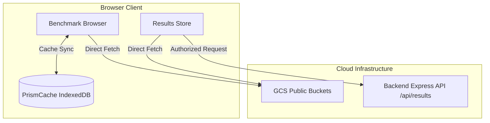

# Frontend Architecture & Implementation Details

This document specifies the frontend implementation of the GitHub OAuth SSO
mechanism, data retrieval strategies, local caching, and submission management
within the Prism dashboard.

---

## 1. Data Retrieval Strategies & Architecture

Prism employs two distinct data ingestion paths on the frontend, optimized for
public explore speed vs. authenticated user history:



### 1.1 Benchmark Browser (GCS Direct Ingestion)

The main Benchmark Browser and charts load directly from GCS to bypass backend
serialization overhead:

- **Mechanism:** Uses the `useGCS` hook to query the Google Cloud Storage JSON
  API directly
  (`GET https://storage.googleapis.com/storage/v1/b/<bucketName>/o`).
- **Parsing:** Handles legacy JSON benchmarks, raw text execution logs, and new
  Results-Store format runs (`.v1.json`) containing Benchmark Report v0.2
  stages.
- **Caching:** Directory lists and parsed telemetry entries are saved locally in
  an IndexedDB database named `PrismCache` managed by `cacheManager.jsx`.
- **Force Refresh:** A reload icon next to GCS connection cards triggers a force
  refresh (`forceRefresh = true`), bypassing the IndexedDB cache and querying
  GCS fresh.
- **Pagination Limit:** GCS listing currently fetches the entire file list in a
  single request. **No pagination or infinite scrolling is implemented yet** for
  GCS-backed browser views.

### 1.2 My Benchmarks & Review Queue (API History)

The Results Store view lists user submissions and their corresponding review
pipeline status:

- **Mechanism:** Calls the backend Results API
  (`GET /api/results?own=true&limit=50`).
- **Authentication:** Enforces GitHub OAuth login; the user's token is passed
  via the `X-Prism-Github-Token` header.
- **Unified Catalog Integration:** Fetched submissions are mapped and merged
  directly with local staged runs (`brv02Runs`) and GCS community benchmarks.
  The client correlates the status of runs by matching their unique IDs.
- **Filter Constraints & KPI Cards:** The constraints limiting advanced filters
  have been removed. Submissions are now displayed in the same unified table as
  public runs, allowing advanced client-side filters (e.g., Model, Hardware, TP,
  Accelerator Count) to apply seamlessly. KPI cards at the top of the Results
  Store page allow users to quickly filter the table by submission state
  (`Staged`, `Under Review` / `Processing`, `In Review`, `Approved` / `Public`,
  `Action Required` / `Rejected`).

---

## 2. GitHub OAuth SSO

### 2.1 Backend OAuth Redirect (`GET /api/auth/github/callback`)

If GitHub App "Expire user authorization tokens" is enabled, the backend
exchanges the OAuth authorization code for an access token and a refresh token.

The redirect URL to the frontend is extended to redirect to the Manage
Benchmarks view (`?view=manage-benchmarks`) and include token lifetime
information in the hash fragment:

```
#access_token=<token>&refresh_token=<token>&expires_in=<seconds>&refresh_token_expires_in=<seconds>&state=<state>
```

### 2.2 Token Refresh Endpoint (`POST /api/auth/github/refresh`)

A backend endpoint is exposed to facilitate access token renewal using a refresh
token.

- **URL:** `/api/auth/github/refresh`
- **Method:** `POST`
- **Request Headers:** `Content-Type: application/json`
- **Request Body:**
    ```json
    {
        "refresh_token": "<refresh_token>"
    }
    ```
- **Response (200 OK):**
    ```json
    {
        "access_token": "<new_access_token>",
        "expires_in": 28800,
        "refresh_token": "<new_refresh_token>",
        "refresh_token_expires_in": 15811200
    }
    ```
- **Response (501 Not Implemented):** Returned if GitHub OAuth is not
  configured.
- **Response (400/500):** Returned if refresh fails.

---

## 3. Frontend Token Lifecycle & Storage

### 3.1 Local Storage Schema

Tokens are stored in the browser's `localStorage` under the following keys:

- `prism_github_access_token`: The current access token string.
- `prism_github_refresh_token`: The current refresh token string.
- `prism_github_access_token_expires_at`: Absolute ISO timestamp (e.g.,
  `2026-07-08T23:59:00Z`) when the access token expires.
- `prism_github_refresh_token_expires_at`: Absolute ISO timestamp when the
  refresh token expires.

### 3.2 Token Parse Flow

Upon mounting the main app, the URL hash fragment is checked for OAuth tokens:

1. Parse hash parameters: `access_token`, `refresh_token`, `expires_in`,
   `refresh_token_expires_in`.
2. If `access_token` is present:
    - Save to `localStorage`.
    - If `expires_in` is present, compute and save `expires_at` (Current Time +
      `expires_in` seconds).
    - Save `refresh_token` if present.
    - If `refresh_token_expires_in` is present, compute and save
      `refresh_token_expires_at`.
3. Clear the hash fragment from the browser URL to keep it clean.

### 3.3 Auto-Renewal Flow

A background timer checks the access token status:

- The token is renewed if it is close to expiration (e.g., less than 5 minutes
  remaining).
- If the access token is expired but a valid refresh token exists, it is
  renewed.
- Renewal calls `POST /api/auth/github/refresh` with the stored `refresh_token`.
  The returned payload is saved in `localStorage`, updating the keys and
  expiration timestamps.
- If renewal fails or the refresh token itself is expired, the session is
  cleared, and the user must re-authenticate.

### 3.4 Redirect State Tracking

To preserve UI state across the external OAuth redirect:

1. When initiating the login flow, a flag `prism_show_submit_dialog_after_login`
   is set to `"true"` in `sessionStorage`.
2. Upon redirecting back from GitHub, the app loads the `results-store` view.
3. The `ResultsStore` page checks `sessionStorage` on mount. If the flag is set,
   it automatically navigates the user to the submit-benchmarks wizard page
   (`intent: 'submit-review'`) and clears the flag.

---

## 4. UI/UX Specifications (Results Store Page)

### 4.1 Header & User Auth Dropdown

The Results Store page header provides identity and session management:

- **Sign In with GitHub:** Appears if the user is unauthenticated.
    - If GitHub OAuth is not configured on the backend (API returns `501`), the
      button is disabled, greyed out, and displays the tooltip:
      `"GitHub OAuth is not configured on this server"`.
- **User Session Dropdown:** Appears when the user is authenticated.
    - Displays user profile avatar and GitHub handle (`@username`).
    - Expanding the dropdown displays the user's role (e.g., `user` or `admin`)
      and a **Sign out** button that invokes `/api/auth/github/logout`.

### 4.2 Full-Page Upload and Stage Wizard (SubmitValidationPage)

Rather than a modal dialog, benchmark ingestion is handled via a dedicated,
full-page wizard supporting two distinct intents (`stage-locally` or
`submit-review`):

#### 4.2.1 Stage Locally Flow (2 Steps)

1. **Upload Files:** Users drag & drop or select local files, or input cloud
   source paths (GCS/S3) to stage. Can also attach deployment manifests or
   config files.
2. **Validation & Preview:**
    - Runs validation checks (`validatePrismUploadStructure`) to inspect schemas
      and warn on format mismatches or gaps.
    - Shows readiness indicators (Format, Model, Hardware) and validation
      statuses (**Ready**, **Warnings**, or **Invalid**).
    - Renders interactive charts comparing performance curves against existing
      public baselines.
    - Clicking **Proceed to Staging** commits files locally to IndexedDB, clears
      staging local storage, and redirects the user back to the Results Store
      with the staged KPI filter active.

#### 4.2.2 Publish/Submit for Review Flow (4 Steps)

1. **Upload Files:** Same as Stage Locally.
2. **Validation & Preview:** Same as Stage Locally, but requires at least one
   valid run without critical errors to proceed.
3. **Attribution & DCO:**
    - Enforces active GitHub authentication (manual sign-in required if not
      logged in).
    - Renders the **Developer Certificate of Origin (DCO) v1.1**.
    - Requires checking a checkbox to sign off and agree to public attribution
      and cloud storage.
    - Allows comma-separated assignment of GitHub usernames as reviewers.
4. **Submit & Confirm:**
    - Shows a summary of valid runs, user attribution, and DCO confirmation.
    - Displays a warning about pull-request style maintenance checks.
    - Clicking **Submit to Review Queue** posts sequential runs to
      `/api/results` via the client.
    - On completion, it re-keys staged run IDs to server-assigned UUIDs,
      triggers a success toast, sets the `submitted` status for the post-upload
      guided actions dialog, and redirects to the Results Store with the
      `my-submissions` KPI filter active.

### 4.3 Post-Upload Guided Action Dialog

A dedicated post-upload dialogue modal is triggered in the Results Store upon
returning from a successful wizard session:

- **Local Session Staging:** Explains next steps for staged files (Compare &
  Inspect curves, add manifests, or Publish).
- **Submission Queued:** Explains how to track the status of queued runs in the
  review pipeline.
