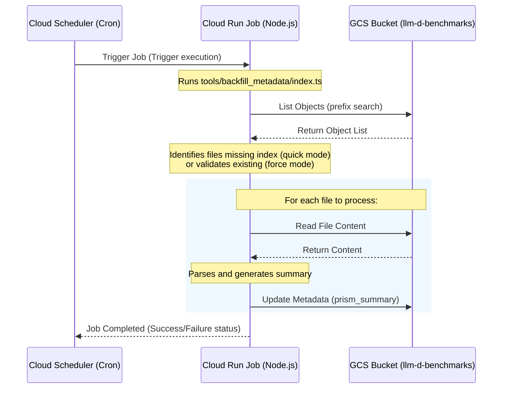

# GCS Metadata Indexing & Backfill Specification

## Status: Implemented

## Overview

Prism's "Manage Benchmarks" dashboard currently scans GCS buckets by listing all
files and then downloading each file to parse its content on the client side.
This causes significant network overhead and slow initial page loads, especially
as the number of benchmark runs grows.

To optimize this, we implement a **GCS Metadata Indexing** strategy. Instead of
downloading full payload files (`.v1.json` or `.yaml` reports), we extract key
performance metrics and metadata during ingestion (or via a backfill process)
and store them as a minified JSON string in a GCS custom metadata field. The
client can then retrieve all necessary metrics for listing and rendering the
dashboard directly from the bucket's list response.

### Design Requirements

- **No Data Creation or Inference During Indexing:** The indexing process must
  not create, guess, or infer any additional information (such as setting
  fallback timestamps to the current date or GCS file modification times) if
  fields are missing in the source payload. All data normalization, inference,
  and formatting must be handled solely by the client-side parsers. Missing
  fields must be represented as `null`.

---

## Technical Design

#### Displayed and Filtered Fields Mapping

> [!NOTE]
>
> **Decision: Omitted Sorting Functionality** To simplify the initial prototype,
> we have decided to completely omit sorting functionality. The dashboard will
> display benchmarks in a default order (chronological by default). The sorting
> fields have been removed from this specification.

The following table documents all benchmark fields that are currently displayed
in the UI or available as filters in the dashboard, along with their source JSON
paths within a standard BRV0.2 benchmark report.

| Field Name                 | UI Filter Name          | Displayed Location              | Source Path in BRV0.2 YAML/JSON                                                                          |
| :------------------------- | :---------------------- | :------------------------------ | :------------------------------------------------------------------------------------------------------- |
| **Model**                  | Models                  | Row Title (Model Name)          | `scenario.stack[primary].standardized.model.name` <br>OR `scenario.load.native.config.server.model_name` |
| **Hardware**               | Accelerators            | Hardware (Accelerator name)     | `scenario.stack[primary].standardized.accelerator.model`                                                 |
| **Accelerator Count**      | Accelerator Count       | Hardware (Count prefix)         | `scenario.stack[primary].standardized.accelerator.count`                                                 |
| **Tensor Parallelism**     | Tensor Parallelism (TP) | Nodes (TP suffix)               | `scenario.stack[primary].standardized.accelerator.parallelism.tp`                                        |
| **Nodes**                  | -                       | Nodes (Node count)              | Derived: `accelerator_count / tp`                                                                        |
| **Input Len (ISL)**        | Input (ISL)             | Input Len Column / Card Header  | `scenario.load.standardized.input_seq_len.value`                                                         |
| **Output Len (OSL)**       | Output (OSL)            | Output Len Column / Card Header | `scenario.load.standardized.output_seq_len.value`                                                        |
| **Model Server / Backend** | Model Server            | Configuration Label             | `scenario.load.standardized.tool` <br>OR `scenario.stack[primary].standardized.tool`                     |
| **Precision**              | Precisions              | -                               | N/A (Hardcoded to `'Unknown'` for BRV0.2)                                                                |
| **Machine Type**           | Machine Type            | -                               | N/A (Not supported for BRV0.2)                                                                           |
| **Serving Stack**          | Serving Stack           | -                               | N/A (Not supported for BRV0.2)                                                                           |
| **Optimizations**          | Optimizations           | -                               | N/A (Not supported for BRV0.2)                                                                           |
| **Components**             | Components              | -                               | Keys of `scenario.stack`                                                                                 |
| **P/D Node Ratio**         | P/D Node Ratio          | -                               | N/A (Not supported for BRV0.2)                                                                           |
| **Workload Type / Ratio**  | Workload Type           | -                               | N/A (Not supported for BRV0.2)                                                                           |
| **Use Case**               | Use Case                | -                               | N/A (Not supported for BRV0.2)                                                                           |
| **Date/Timestamp**         | -                       | Card Header                     | `run.time.start`                                                                                         |
| **Stages**                 | -                       | Card Header (Stage count)       | Count of stages in run (based on `scenario.load.standardized.stage`)                                     |
| **Max Throughput**         | -                       | Card Header                     | Max `results.request_performance.aggregate.throughput.output_token_rate.mean` across stages              |
| **Min Latency**            | -                       | Card Header                     | Min `results.request_performance.aggregate.latency.request_latency.mean` across stages                   |

_Note: `primary` refers to the primary component resolved from `scenario.stack`
(typically the component with role `aggregate`/`decode` or kind
`inference_engine`). Card Header metrics for single-stage runs display that
stage's metric; for multi-stage runs, they display the metric of the "peak"
stage (highest output throughput)._

### Custom Metadata Schema

We will store the indexed metrics in a single GCS custom metadata key:
`prism_summary`. The value of this key will be a minified JSON array of
`NormalizedBenchmarkEntry` structures containing all fields required for
rendering and filtering in the UI (excluding detailed stage-level metrics, raw
reports, and diagnostics to keep size under GCS limits):

```json
[
    {
        "runLabel": "Llama3-H100-TP8",
        "github_author": {
            "username": "diamondburned"
        },
        "model": "meta-llama-llama-3-8b-instruct",
        "model_name": "meta-llama-llama-3-8b-instruct",
        "hardware": "H100",
        "precision": "Unknown",
        "backend": "vllm",
        "isl": 512,
        "osl": 128,
        "timestamp": "2026-07-09T10:00:00Z",
        "throughput": 2500.0,
        "latency": {
            "mean": 120.5
        },
        "components": ["LeaderWorkerSet"],
        "metadata": {
            "model_name": "meta-llama-llama-3-8b-instruct",
            "backend": "vllm",
            "hardware": "H100",
            "accelerator_type": "H100",
            "accelerator_count": 8,
            "precision": "Unknown",
            "timestamp": "2026-07-09T10:00:00Z",
            "tp": 8,
            "architecture": "aggregate",
            "components": ["LeaderWorkerSet"]
        },
        "workload": {
            "input_tokens": 512,
            "output_tokens": 128,
            "stage": 1
        }
    }
]
```

---

## System Architecture & Implementation

### 1. Metadata Backfill & Validation Utility

The project includes a command-line backfill utility script at
[index.ts](../../../tools/backfill_metadata/index.ts). It scans target GCS
buckets, parses benchmark files, and populates the `prism_summary` custom GCS
metadata field.

- **Command**: `npm run backfill-metadata -- <mode> [options]`
- **Positional Arguments**:
    - `mode`: Execution mode. Either `quick` (skips files already having
      `prism_summary` metadata) or `force` (unconditionally re-parses and
      updates GCS metadata if changed).
- **Options**:
    - `-d, --dry-run`: Preview changes without updating GCS metadata.
    - `-e, --env <env>`: Target environment bucket. Defaults to `staging`
      (`gs://llm-d-benchmarks-staging`). Use `prod` or `production` to target
      `gs://llm-d-benchmarks`.
- **Ad-hoc Folder Qualification & File-Level Indexing Strategy**:
    - Objects outside `/prism-results-store` are grouped by their direct parent
      directory (`runId`).
    - **Qualified File Types**:
        - **BRV0.2 Reports (`.yaml` / `.yml`)**: YAML files starting with
          `version: '0.2'` parsed using `parseReportV02`.
        - **Legacy & Stage Reports (`.json` / `.yaml`)**: Files matching old
          report patterns `benchmark_report,.*` (excluding BRV0.2 versions) with
          `.metrics` or files named `stage_X_lifecycle_metrics.json` /
          `summary_lifecycle_metrics.json` containing `.load_summary` (referred
          to as BRV0.1).
        - **Log Files (`.log`)**: Standard execution logs (`stdout.log` and
          `stderr.log`) parsed using `parseLogFile` to extract embedded latency
          profiles or lifecycle outputs.
    - **Explicit Exclusion (`per_request_lifecycle_metrics.json`)**:
        - The `per_request_lifecycle_metrics.json` file MUST ALWAYS BE IGNORED
          during backfill scanning, server-side content retrieval, and client
          fallbacks due to its excessively large file size (per-token arrays).
    - **BRV0.2 vs BRV0.1 Precedence Rules**:
        - If a folder contains both BRV0.2 (BRV02) and legacy BRV0.1 report
          files:
            - **Indexing (Backfill)**: Only BRV0.2 files are parsed to generate
              the `prism_summary` metadata list. The resulting BRV0.2 summary is
              written to the GCS custom metadata on all parsed files (both
              BRV0.1 and BRV0.2) so that any listing file representative holds
              the preferred BRV0.2 index.
            - **Content Retrieval (`GET /api/benchmarks/content`)**: The server
              will only process and merge parsed BRV0.2 files, completely
              ignoring BRV0.1 files in that directory.
    - **File-Level Summary Metadata**:
        - Instead of sharing a merged summary across all files in a folder, each
          qualified file is parsed independently and assigned a separate,
          file-specific `prism_summary` metadata string containing only the
          stage/profile entries extracted from that file.
    - In keeping with the **Design Requirements**, all dynamic timestamps are
      stripped out and set to `null` if no stable timestamp is present in the
      payload or filename, ensuring stable deterministic hashes. The folder base
      name is used as the deterministic `runLabel`.

### 2. Ingestion-Time Indexing (Results Store)

When benchmarks are submitted to `POST /api/results`:

1. The backend ingestion flow invokes `extractSummaryFromPayload` in
   [gcs.ts](../../../server/results/gcs.ts).
2. It parses each stage entry in the payload, maps them to minified summary
   structures, and returns a serialized summary array.
3. The server writes the serialized JSON string to the GCS standard custom
   metadata field `metadata.prism_summary` inside `writeResult`, ensuring it is
   saved in GCS at the time of upload.

### 3. Backend HTTP API Endpoints

The Express server exposes two endpoints for listing and retrieval under
[benchmarks.ts](../../../server/results/routes/benchmarks.ts):

#### `GET /api/benchmarks`

- **Purpose**: Lists benchmark summaries in GCS.
- **Parameters**: `bucket` (optional target bucket), `prefix` (optional GCS path
  filter).
- **GCS Listing Deduplication & Representative Selection**:
    - Objects are batched and grouped by their `runId` (the direct parent folder
      path).
    - The server scans files inside each folder and selects a single
      representative file containing a valid `prism_summary` (preferring files
      like `summary_lifecycle_metrics.json` or `stdout.log` over individual
      stage files) to provide the metadata summary for the list response.
    - Paging state and nextPageToken cursors are calculated based on original
      GCS file indices to ensure paging reliability.
- **Authorization**: Standard Results Store restrictions apply to
  `prism-results-store/` objects (Admins see all, standard users see own or
  public/promoted).

#### `GET /api/benchmarks/content`

- **Purpose**: Retrieves the full text content of a GCS benchmark file or merges
  all qualified files inside a folder run.
- **Parameters**: `path` (GCS object path or folder path), `bucket` (target GCS
  bucket).
- **Behavior**:
    - If `path` is a single file path (ends with a standard file extension like
      `.json`, `.yaml`, etc.), the endpoint returns the raw file contents (if
      not ignored).
    - If `path` represents an ad-hoc directory path, the endpoint lists all
      files matching that prefix inside the bucket, filters out ignored files
      such as `per_request_lifecycle_metrics.json`, downloads and parses all
      qualified JSON/log files in the folder, injects the `_source_file`
      filename to each parsed object, and returns a merged JSON array.
- **Authorization**: Enforces standard Results Store access checks for
  `prism-results-store/` paths.

#### Troubleshooting: Missing Results Store Benchmarks

Because all Results Store benchmark files uploaded to
`gs://llm-d-benchmarks-staging` or `gs://llm-d-benchmarks` default to a
`submission_state` of `submitted_pending_review`, access controls are strictly
enforced:

- **Anonymous Users**: Cannot see any Results Store files in GCS listings.
- **Standard Users**: Can only see files they authored (`github_user` metadata
  matches the authenticated session user).
- **Admins**: Can see all submissions.

If developers are running the Prism application locally and do not see their
`prism-results-store` benchmarks in the GCS connection lists, they must:

1. Ensure the GitHub OAuth environment variables (`GITHUB_CLIENT_ID` and
   `GITHUB_CLIENT_SECRET`) are configured in their local
   environment/`docker-compose.yml`.
2. Authenticate/log in with the GitHub account that matches the `github_user`
   custom metadata value on their uploaded GCS run objects.

### 4. Client Integration & Lazy Loading Flow

#### A. Listing Mode (Fast Path)

1. The [useGCS.js](../../../src/hooks/useGCS.js) hook fetches the list of
   benchmarks via `GET /api/benchmarks?bucket=...`.
2. If `prism_summary` is present in the item metadata, it directly maps the
   minified stage entries, flags them as `isFull: false`, and loads them into
   the state cache, bypassing file downloads entirely.
3. If the metadata is missing, it falls back to downloading the full object
   content and parsing it client-side as before, marking them `isFull: true`.

#### B. Dynamic Fetching (Comparison Mode)

1. When a user selects a benchmark config for comparison, a `useEffect` hook in
   [useDashboardData.jsx](../../../src/hooks/useDashboardData.jsx) checks for
   entries in the selection group that only have summary data (`!d.isFull`).
2. It gathers all unique GCS file URLs in the group and triggers a lazy download
   via `GET /api/benchmarks/content`.
3. Upon retrieval, entries are parsed, flagged as `isFull: true`, and replace
   the matching summary entries in the dashboard `data` array.

#### C. Spinner Overlay UX

- While detailed metrics are being lazy-fetched, the comparison charts
  ([RunComparisonChart.jsx](../../../src/components/Dashboard/RunComparisonChart.jsx)
  and
  [ThroughputCostChart.jsx](../../../src/components/Dashboard/ThroughputCostChart.jsx))
  render a loading spinner overlay to keep the UX clean and premium.

---

### Future Work: Periodic Cloud Run Job

To ensure that the metadata index remains accurate and up-to-date over time
(especially for ad-hoc uploads that bypass the Results Store ingestion flow, or
in case of schema/parser updates), we will transition the backfill script into a
managed, periodic background job.

#### 1. Architecture Overview



#### 2. Implementation Steps

1.  **Containerization:**
    - Create a `Dockerfile` for the backfill script environment.
    - Package `tools/backfill_metadata/index.ts` along with necessary parsers
      and dependencies.
2.  **Cloud Run Job Deployment:**
    - Deploy the container as a **Cloud Run Job** (designed for
      run-to-completion tasks).
    - Configure service account permissions: The job needs
      `roles/storage.objectAdmin` on `gs://llm-d-benchmarks/` to read files and
      update metadata.
3.  **Cloud Scheduler Setup:**
    - Create a **Cloud Scheduler** trigger.
    - Configure it to run on a periodic cron schedule (e.g., `@daily` at
      midnight, or `@weekly`).
    - Target the Scheduler to trigger the Cloud Run Job.
4.  **Monitoring & Alerting:**
    - Configure Cloud Logging to capture script output.
    - **Execution Metrics:** At the end of each run, the job must log a
      structured JSON summary of execution metrics to Cloud Logging:
        ```json
        {
            "event": "backfill_complete",
            "timestamp": "2026-07-09T12:00:00Z",
            "duration_seconds": 45.2,
            "metrics": {
                "files_found": 150,
                "files_checked": 120,
                "files_processed_success": 15,
                "files_skipped": 100,
                "files_updated": 15,
                "errors": 5
            }
        }
        ```
    - Set up alerts for job failures or high error rates based on these
      structured logs.
