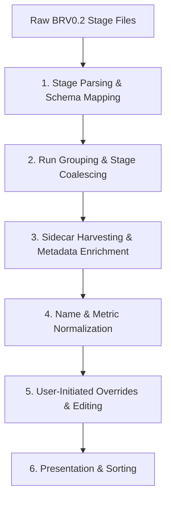

# Prism BRV0.2 Parser & Data Model Specification

This document defines the specification for how Prism parses, groups,
normalizes, and enriches **llm-d-benchmark Benchmark Report v0.2 (BRV0.2)**
files, both individually and in groups, to build unified benchmark run payloads.

---

## 1. Core Ingestion Pipeline Overview

Prism processes uploaded or scanned benchmark report files through a structured
data ingestion pipeline. This pipeline guarantees that raw stage-level reports
generated by disparate upstream harnesses (e.g., `inference-perf`, `guidellm`,
`vllm-benchmark`, `inferencemax`, `nop`) are unified, enriched, and normalized
before being presented on the comparison dashboard.



---

## 2. Stage Parsing & Schema Mapping

The entry point of the pipeline is
[benchmarkReportV02Parser.js](file:///usr/local/google/home/diamondburned/Projects/llm-d/llm-d-prism/src/utils/benchmarkReportV02Parser.js).
It parses raw JSON/YAML stage reports into flat, standardized internal stage
records.

> [!NOTE] Rather than generating synthetic entity IDs at the parser level, the
> parser preserves the original `run.uid` as `runUid`. The frontend client or
> BFF generates a fresh UUIDv4 at the run/stage level during ingestion.

Each individual parsed stage is mapped to a flat stage record structure
containing:

### 2.1 Identification

- `runId`: A unique UUIDv4 generated by Prism.
- `runLabel`: A human-friendly run description label (e.g., extracted from
  scenario, directories, or filename).
- `filename`: Original report filename.
- `runUid`: The original `run.uid` from the benchmark report.
- `runEid`: The original `run.eid` (Experiment ID).
- `runCid`: The original `run.cid`.
- `runPid`: The original `run.pid`.
- `timestamp`: Execution start timestamp (`run.time.start`).
- `stageIndex`: Standardized benchmark stage number
  (`scenario.load.standardized.stage`).

### 2.2 Scenario Details

- `model`: Model name parsed from standard stack component or server config.
- `hardware`: Accelerator model name.
- `acceleratorCount`: Total accelerator count.
- `tp`: Tensor Parallelism degree.
- `role`: Component role (e.g., `aggregate`, `decode`).
- `harness`: Standard load tool identity (e.g., `inference-perf`, `guidellm`).
- `isl` & `osl`: Input and output sequence lengths.
- `rateQps` & `concurrency`: Traffic load characteristics.

### 2.3 Performance Metrics

- Output token throughput rate (`throughput` representing output tokens/s).
- Input token throughput rate (tokens/s).
- Request rate (req/s).
- **Latency values (converted from seconds to milliseconds):**
    - Time-To-First-Token (TTFT) mean, p50, and p99.
    - Time-Per-Output-Token (TPOT) mean, p50, and p99.
    - Inter-Token Latency (ITL) mean, p50, and p99.
    - End-to-End request latency mean, p50, and p99.
- Total requests count and failure count.

### 2.4 Observability Metrics (Optional)

- Mean, p50, and p99 of KV cache utilization (normalized to 0-100%).
- Mean, p50, and p99 of prefix cache hit rate (normalized to 0-100%).
- Engine pool metrics (epp pool KV utilization, queue size, running requests).
- Running, waiting, and preempted request counts.
- Pod startup latency statistics (mean, p50, p99 in seconds).

### 2.5 System Components

- List of infrastructure components (e.g., `Inference Gateway`,
  `Inference Scheduler`, `LeaderWorkerSet`) extracted from the stack definition.

---

## 3. Run Grouping & Stage Coalescing

Benchmark runs typically consist of multiple sequential stages.
[groupStagesIntoRuns](file:///usr/local/google/home/diamondburned/Projects/llm-d/llm-d-prism/src/utils/benchmarkReportV02Parser.js#L304)
coalesces individual stage records into a single consolidated run.

1. **Explicit Run ID:** If stage files contain a matching `runId`, they are
   grouped under that run.
2. **Directory-Based Grouping:** Files uploaded from the same directory are
   grouped into a single run.
3. **Coalescing Fallback:** If directory or run ID details are absent, stages
   are coalesced into a single run if they share the exact same
   `scenario.load.metadata`. Prism uses a canonical, deep-sorted JSON
   serialization
   [canonicalStringify](file:///usr/local/google/home/diamondburned/Projects/llm-d/llm-d-prism/src/utils/benchmarkReportV02Parser.js#L296)
   of the metadata for equivalence checks.
4. **Chronological Sorting:** Inside a grouped run, stage records are sorted
   chronologically by their parsed `stageIndex`.
5. **Label Propagation:** Once grouped, the resolved run label is propagated to
   all constituent stages.

---

## 4. Automated Metadata Enrichment & Fallbacks

To handle missing or incomplete metadata in individual stage files, the parser
enriches the payload by harvesting supplementary files and stack configurations.

### 4.1 Sidecar Directory Harvesting

During local file staging or cloud bucket synchronization, Prism searches the
directory containing the stage reports for sidecar files:

- `run_metadata.yaml`: Contains high-level context of the run (accelerator,
  model, replication).
- `config.yaml`: Contains deployment kustomize parameters.
- `summary_lifecycle_metrics.json`: Contains overall lifecycle metrics.

### 4.2 Hardware Resolution & Fallback Hierarchy

If the benchmark stages do not specify an accelerator model, Prism attempts to
resolve it using the following fallbacks:

1. **Metadata Acceleration:** Reads `run_metadata.accelerator` from the raw
   `run_metadata` block (if uploaded).
2. **Namespace Matching:** If the namespace defined in `run_metadata.namespace`
   contains `tpu` or `gpu`, it assigns `TPU` or `GPU` respectively.
3. **Kustomize Backend Inference:** Checks `config.kustomize.acceleratorBackend`
   to resolve TPU versions or GPU types (e.g., `tpu-v6` -> `TPU v6e`, `h100` ->
   `H100`).
4. **Standalone Type Mapping:** Resolves standalone accelerator type
   configuration from `config.standalone.acceleratorType.labelValue` or
   `config.prefill.acceleratorType.labelValue`.
5. **Backfill Propagation:** Once resolved, the hardware definition is
   propagated back to all individual stage entries, updating them from
   `Unknown`.

### 4.3 Inference Engine & Version Extraction

The parser automatically extracts standard inference engine identities (`vllm`,
`tgi`, `sglang`) and their versions from the component stack of the first valid
stage in the run to populate the root-level metadata.

---

## 5. Data Normalization & Standardization

To enable reliable filtering, sorting, and comparison across all data sources,
model and hardware names are normalized during ingestion.

### 5.1 Model Name Normalization

The model name is extracted and normalized via the
[normalizeModelName](file:///usr/local/google/home/diamondburned/Projects/llm-d/llm-d-prism/src/utils/dataParser.js#L98)
utility:

- **Segment Extraction:** If the model name is org-prefixed or a directory path
  (e.g. `meta-llama/Llama-3-70b`), only the last segment (`Llama-3-70b`) is
  kept.
- **Metadata Stripping:** Parenthesized suffixes (e.g., `(vllm, FP8)`) and
  bracketed suffixes (e.g., `[kv]`) are stripped.
- **Suffix Cleansing:** Standard precision suffixes that cause redundant
  duplicate filters (such as `-bf16`, `-fp16`, `-int8`, `-fp8`, `-fp4`) are
  removed.
- **Case-Insensitive Unification:** Model names are stored and matched using
  their lowercase form. The dashboard establishes a casing map to present
  human-friendly names in options and tables.

### 5.2 Hardware Accelerator Normalization

Hardware names are resolved and standardized using the
[normalizeHardware](file:///usr/local/google/home/diamondburned/Projects/llm-d/llm-d-prism/src/utils/dataParser.js#L120)
utility:

- **Canonical Mappings:** Standardizes GPUs and TPUs into unified identifiers
  (e.g., `GB200`, `B200`, `H200`, `H100`, `A100`, `L4`, `T4`, `MI300X`,
  `MI325X`, `MI355X`).
- **NVIDIA Prefix Stripping:** Cleanses the `nvidia-` prefix from GPU
  identifiers.
- **TPU Suffix Stripping:** Removes suffixes such as `-slice` and `-podslice`
  from TPU descriptions.
- **Standard Casing:** Normalizes remaining non-GPU/non-TPU strings to
  uppercase.

---

## 6. User-Initiated Overrides & Editing

When staging benchmark runs in the Prism Cloud UI (on the staging/validation
wizard page), users can live-edit specific metadata fields to correct or
complete missing information before submitting.

### 6.1 UI-Staging Validation and Runtime Propagation

- **Root-Level Updates:** Edits update the root `model_name`,
  `hardware.hardware_name`, and `hardware.accelerator_count` properties of the
  run package.
- **Metadata Propagation:** The changes are passed to the stage normalization
  utility
  [stageToEntry](file:///usr/local/google/home/diamondburned/Projects/llm-d/llm-d-prism/src/utils/benchmarkReportV02Parser.js#L381)
  during runtime, ensuring individual stages fall back to root properties if
  their raw stage report files lack this information.
- **Raw BRV0.2 Untouched:** None of the live-edited fields modify the raw
  reports stored in `$.entries[].raw_report` or the `$.run_metadata` block,
  preserving them for reference and auditing.

### 6.2 Editable Metadata Schema

> [!IMPORTANT] **Keep in Sync with Code:** Developers and agentic assistants
> MUST always keep this table in sync with actual code changes to frontend
> staging edit handlers (e.g., `updateSingleField` in
> [SubmitValidationPage.jsx](file:///usr/local/google/home/diamondburned/Projects/llm-d/llm-d-prism/src/components/DataConnections/SubmitValidationPage.jsx)),
> backend API payload schemas (`PrismResultPayload` in
> [api.ts](file:///usr/local/google/home/diamondburned/Projects/llm-d/llm-d-prism/server/results/api.ts)),
> and vice-versa.

| Field Name               | Purpose                                                                                              | UI Field Name          | Storage Location in Payload    | GCS Custom Context              | Alters Raw BRV0.2? |
| :----------------------- | :--------------------------------------------------------------------------------------------------- | :--------------------- | :----------------------------- | :------------------------------ | :----------------: |
| `runLabel`               | Human-friendly description/label identifying the overall benchmark run. Defaults to the folder name. | Benchmark Name         | `$.runLabel`                   | `contexts.custom.run_label`     |         No         |
| `model_name`             | Standardized, canonical name of the target model evaluated.                                          | Model Name             | `$.model_name`                 | `contexts.custom.model_name`    |         No         |
| `hardware_name`          | Normalized name of the accelerator hardware.                                                         | Detailed Hardware      | `$.hardware.hardware_name`     | `contexts.custom.hardware_name` |         No         |
| `accelerator_count`      | Number of accelerator chips used.                                                                    | Accelerator/Chip Count | `$.hardware.accelerator_count` | N/A                             |         No         |
| `inference_tool`         | Primary software tool/engine used for inference.                                                     | Serving Stack / Tool   | `$.inference_tool`             | N/A                             |         No         |
| `inference_tool_version` | Software version of the primary inference tool.                                                      | Serving Stack Version  | `$.inference_tool_version`     | N/A                             |         No         |

---

## 7. Presentation & Sorting Semantics

### 7.1 Natural Numeric-Aware Sorting

To ensure intuitive grid and table navigation, any UI string-based sorting for
sequence lengths, facets, run IDs, and numeric metrics uses a locale-sensitive
numeric sort:

```javascript
localeCompare(otherString, undefined, {
    numeric: true,
    sensitivity: "base",
});
```

This guarantees that sequence lengths (e.g., "128", "256", "1024") are ordered
numerically rather than lexicographically.
