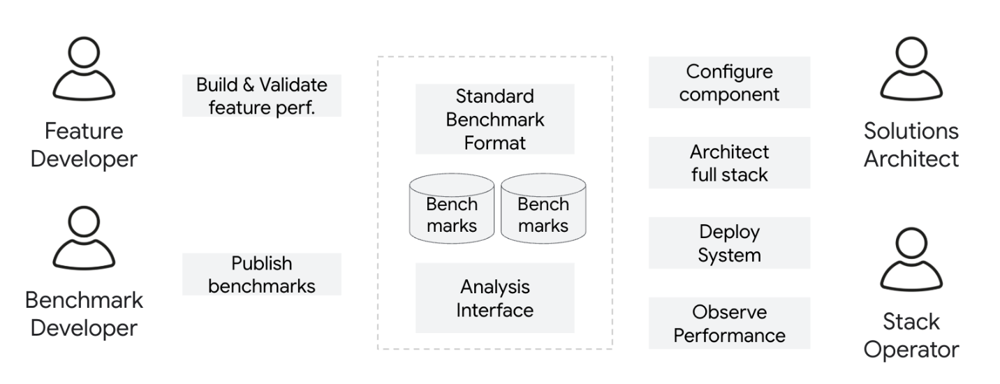

# User Profiles and Skills

This directory contains specialized skills tailored for different user profiles involved in the llm-d project. These skills are designed to assist agents in developing features, tuning configurations, and maintaining production stability.

## User Roles

### 1. [Feature Developer](llm-d-feature-developer/SKILL.md)
**Focus:** Ensures new features hit price/performance goals and can be shared easily.
- Automates baseline A/B test validations.
- Separates unit vs. system benchmarks.
- Produces reproducible and shareable artifacts.

### 2. [Config Tuner](config-tuner/SKILL.md) (Solutions Architect / Customer Engineer)
**Focus:** Tailored for defining and sweeping optimal end-to-end component stacks.
- Orchestrates complex configuration sweeps (Parallelism, vLLM config, etc.).
- Isolates test environments.
- Generates verifiable reference architecture matrices.

### 3. [Stack Operator](llm-d-stack-operator/SKILL.md)
**Focus:** Prioritizes production stability and regression tracking.
- Runs standard "well-lit paths".
- Sets up deep stress testing telemetry.
- Compares footprints vs. historical production data.

### 4. [Benchmark Developer](benchmark-developer/SKILL.md) (Analyst / PR)
**Focus:** Tailored towards community-facing output.
- Generates clear, presentation-ready graphs and visualizations.
- Compares llm-d against competitors.
- Focuses on user-facing metrics without requiring deep codebase knowledge.
